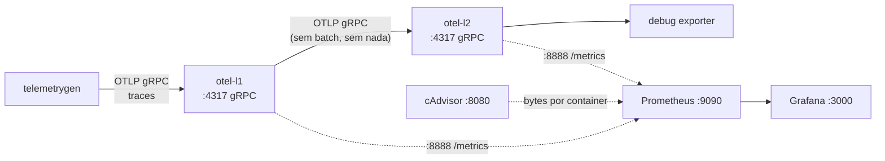

# scenario-01 — gRPC l1 => gRPC l2

## Mermaid



## Services

| componente                           | version  |
| ------------------------------------ | -------- |
| otel/opentelemetry-collector-contrib | 0.151.0  |
| ghcr.io/.../telemetrygen             | v0.151.0 |
| prom/prometheus                      | v2.55.1  |
| grafana/grafana                      | 12.0.0   |
| gcr.io/cadvisor/cadvisor             | v0.49.1  |

## Reproduce

```bash
./run.sh
```

```bash
DURATION=10m WORKERS=4 ./run.sh
```

> Defaults: `DURATION=5m`, `WORKERS=2`, 20 atributos por span.


Para visualização contínua durante o teste, o `cAdvisor` exporta
`container_network_receive_bytes_total{name="otel-l2"}` no Prometheus.

A Grafana já sobe **com datasource Prometheus e dashboards oficiais
provisionados** (`grafana/provisioning/`):

- **Cadvisor exporter** — Grafana.com ID `14282`
- **OpenTelemetry Collector** — Grafana.com ID `15983`

Acesse `http://localhost:3000` (login anônimo como Admin) → Dashboards.
Para queries ad-hoc, plote por exemplo:

```promql
rate(container_network_receive_bytes_total{name="otel-l2"}[1m])
rate(container_network_transmit_bytes_total{name="otel-l1"}[1m])
```


## Saída esperada (`results.log`)

```text
====================================================
scenario-01 — gRPC l1 -> gRPC l2 (sem batch, sem nada)
  start:      2026-04-29T12:00:00Z
  duration:   300s (alvo 5m)
  workers:    2
  attributes: 20

  iface                  rx              tx
  otel-l1            1.2GiB          1.2GiB
  otel-l2            1.2GiB         12.5KiB

  Bytes l1 -> l2 (gRPC) ≈ otel-l2.rx = 1.2GiB  (= 1288490188 B)

  spans recebidos no l1: 18234567
  spans enviados pelo l1: 18234567
  spans recebidos no l2: 18234567
====================================================
```

(Os números acima são ilustrativos — preencha com a sua execução real.)

## Reset entre rodadas

```bash
docker compose down -v
```