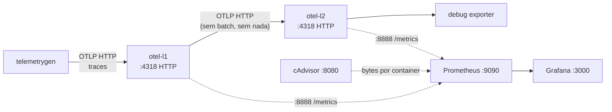

# scenario-02 — HTTP l1 → HTTP l2 (sem batch, sem nada)

Topologia mínima para medir quantos bytes trafegam entre dois OpenTelemetry
Collectors quando o L1 só repassa o que recebe, sem `batch`, sem `compression`,
sem nenhum processor.



Versões fixadas:

| componente                            | versão   |
| ------------------------------------- | -------- |
| otel/opentelemetry-collector-contrib  | 0.151.0  |
| ghcr.io/.../telemetrygen              | v0.151.0 |
| prom/prometheus                       | v2.55.1  |
| grafana/grafana                       | 12.0.0   |
| gcr.io/cadvisor/cadvisor              | v0.49.1  |

## Como rodar

```bash
./run.sh
```

Defaults: `DURATION=5m`, `WORKERS=2`, 20 atributos por span. Os parâmetros
podem ser sobrescritos via env:

```bash
DURATION=10m WORKERS=4 ./run.sh
```

O script:

1. Sobe `otel-l1`, `otel-l2`, `prometheus`, `grafana`, `cadvisor`.
2. Lê `RX/TX` de cada collector via `/proc/net/dev` (snapshot inicial).
3. Roda `telemetrygen traces` por `DURATION` com `WORKERS` paralelos e
   `--telemetry-attributes attrXX="vXX"` × 20.
4. Lê `RX/TX` final, calcula o delta.
5. Lê `otelcol_receiver_accepted_spans_total` e
   `otelcol_exporter_sent_spans_total` em cada collector.
6. Anexa o resultado em `results.log`.

## Como bytes são contados

- `otel-l2.rx` = total bytes recebidos pelo container L2.  Como nada além do
  L1 manda dados pra ele (Prometheus só faz GET em `:8888`, ~0.5 KB por
  scrape, ≈30 KB em 5 min), esse valor é praticamente igual ao tráfego
  **L1 → L2 (HTTP)**.
- `otel-l1.rx` é o que entra (telemetrygen + scrape do Prom).
- `otel-l1.tx` é o que sai (forward para L2 + resposta dos scrapes).

Para visualização contínua durante o teste, o `cAdvisor` exporta
`container_network_receive_bytes_total{name="otel-l2"}` no Prometheus.

A Grafana já sobe **com datasource Prometheus e dashboards oficiais
provisionados** (`grafana/provisioning/`):

- **Cadvisor exporter** — Grafana.com ID `14282`
- **OpenTelemetry Collector** — Grafana.com ID `15983`

Acesse `http://localhost:3000` (login anônimo como Admin) → Dashboards.
Para queries ad-hoc, plote por exemplo:

```promql
rate(container_network_receive_bytes_total{name="otel-l2"}[1m])
rate(container_network_transmit_bytes_total{name="otel-l1"}[1m])
```

## Endpoints

| serviço    | porta host | nota                                 |
| ---------- | ---------- | ------------------------------------ |
| otel-l1    | 4318       | OTLP HTTP (entrada)                  |
| otel-l1    | 8888       | métricas internas                    |
| otel-l2    | 5318       | OTLP HTTP (debug — não use no run)   |
| otel-l2    | 8889       | métricas internas                    |
| prometheus | 9090       |                                      |
| grafana    | 3000       | admin/admin (anônimo Admin)          |
| cadvisor   | 8080       |                                      |

## Saída esperada (`results.log`)

```text
====================================================
scenario-02 — HTTP l1 -> HTTP l2 (sem batch, sem nada)
  start:      2026-04-29T12:00:00Z
  duration:   300s (alvo 5m)
  workers:    2
  attributes: 20

  iface                  rx              tx
  otel-l1            1.2GiB          1.2GiB
  otel-l2            1.2GiB         12.5KiB

  Bytes l1 -> l2 (HTTP) ≈ otel-l2.rx = 1.2GiB  (= 1288490188 B)

  spans recebidos no l1: 18234567
  spans enviados pelo l1: 18234567
  spans recebidos no l2: 18234567
====================================================
```

(Os números acima são ilustrativos — preencha com a sua execução real.)

## Reset entre rodadas

```bash
docker compose down -v
```

## Observações

- L1 e L2 ficam em `restart: unless-stopped`. Se você matar e subir de
  novo o stack sem `down`, os contadores de `/proc/net/dev` zeram porque o
  container reinicia — o script lê *antes/depois* do `telemetrygen`, então
  está OK desde que você não restarte os collectors no meio.
- `batch`, `memory_limiter`, `compression`, headers customizados — tudo
  ausente de propósito. É a baseline.
