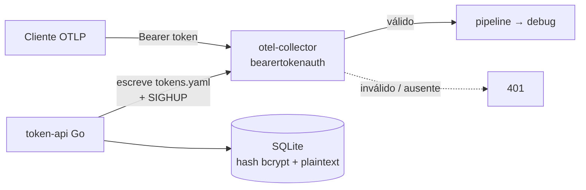

# 01 — Bearer Token

Collector valida `Authorization: Bearer <token>` via extensão [`bearertokenauth`](https://github.com/open-telemetry/opentelemetry-collector-contrib/tree/main/extension/bearertokenauthextension). Uma **API Go** gera/revoga tokens, regrava o `tokens.yaml` (lista pura, volume privado) e sinaliza o collector para recarregar.



## Rodar

```bash
docker compose up --build -d

# cria token (guarde — só aparece uma vez)
curl -sX POST localhost:8080/tenants -H 'X-Admin-Key: change-me-admin-key' \
  -H 'Content-Type: application/json' \
  -d '{"name":"app","email":"dev@example.com","ttl_hours":720}'

# envia telemetria (TOKEN = campo "token" acima)
curl -i localhost:4318/v1/traces -H "Authorization: Bearer $TOKEN" \
  -H 'Content-Type: application/json' -d '{"resourceSpans":[]}'

docker compose down -v
```

Sem header → `401`. Token inválido → `401`. Token válido → `200`.

## Trade-offs

- **Token é bearer**: quem tem, usa. TLS no ingress é obrigatório.
- **Reload via SIGHUP**: o collector relê `tokens.yaml` reiniciando (restart policy) — janela curtíssima, sem reload gráfico nativo.
- **Sem expiração nativa** na extensão: a API filtra expirados e regrava a cada 60s.
- Collector roda como UID `65532` (igual à API) para ler o `tokens.yaml` `0600` do volume compartilhado.
