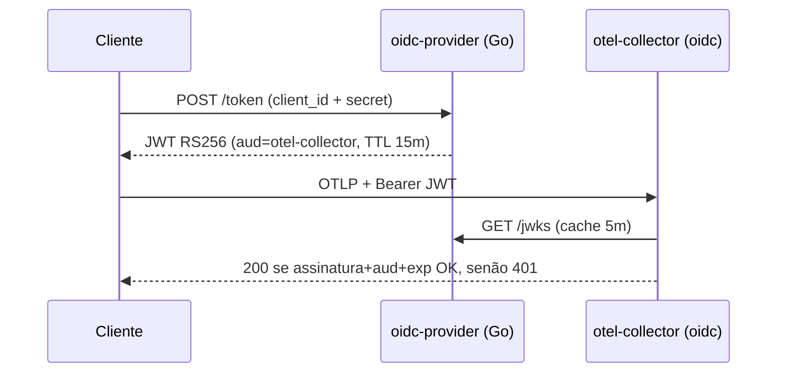

# 02 — OIDC + JWT

Collector valida JWTs RS256 via extensão [`oidc`](https://github.com/open-telemetry/opentelemetry-collector-contrib/tree/main/extension/oidcauthextension): assinatura (JWKS do issuer), `iss`, `aud` e `exp`. Um **provider OIDC mínimo em Go** emite tokens via `client_credentials`. Em produção troque por Keycloak/Dex/Auth0.



## Rodar

```bash
docker compose up --build -d

# registra cliente
curl -sX POST localhost:9000/admin/clients -H 'X-Admin-Key: change-me-admin-key' \
  -H 'Content-Type: application/json' -d '{"client_id":"app-a","tenant_id":"tenant-a"}'
# -> { "client_secret": "..." }

# pega JWT
curl -sX POST localhost:9000/token \
  -d 'grant_type=client_credentials&client_id=app-a&client_secret=SECRET'
# -> { "access_token": "<jwt>", "expires_in": 900 }

# envia telemetria
curl -i localhost:4318/v1/traces -H "Authorization: Bearer $JWT" \
  -H 'Content-Type: application/json' -d '{"resourceSpans":[]}'

docker compose down -v
```

## Trade-offs

- **Padrão de mercado** (OAuth2/OIDC), tokens curtos, revogação por rotação de JWK.
- Validação RSA custa ~µs/req — irrelevante em volume normal; para >100k req/s use ES256/EdDSA.
- O claim `tenant_id` é validado, mas propagá-lo a resource attributes exige **processor custom** (OTTL não lê o auth context) — fora do pipeline neste exemplo.
- Signing key RSA-2048 gerada no boot e persistida em volume `0600`. Em produção: KMS/HSM.
