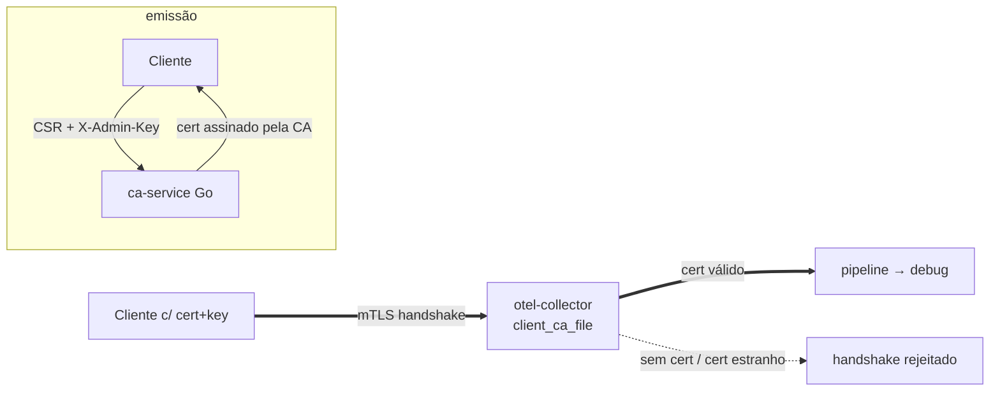

# 03 — mTLS com CA própria

O collector exige certificado de cliente assinado por uma **CA privada** (`client_ca_file` no `tls` do receiver OTLP). Quem não apresenta cert válido é rejeitado **no handshake TLS** — auth de custo zero por requisição. Um **ca-service Go** assina CSRs de cliente sob demanda.



## Rodar

```bash
./gen-certs.sh            # gera tls/ (CA + server cert) — dev only
docker compose up --build -d

# cliente: chave + CSR
openssl req -newkey rsa:2048 -nodes -keyout client.key \
  -subj "/CN=app-a/O=tenant-a" -out client.csr

# assina via ca-service
curl -sX POST localhost:9100/sign -H 'X-Admin-Key: change-me-admin-key' \
  -H 'Content-Type: application/x-pem-file' --data-binary @client.csr -o client.crt

# envia telemetria com mTLS
curl --cert client.crt --key client.key --cacert tls/ca.crt \
  https://localhost:4318/v1/traces \
  -H 'Content-Type: application/json' -d '{"resourceSpans":[]}'

docker compose down -v
```

Sem cert de cliente → conexão recusada no handshake. Com cert assinado pela CA → `200`.

## Trade-offs

- **Identidade criptográfica forte**: o segredo (chave privada) nunca trafega; ideal para gRPC long-lived.
- **Custo zero por request** após o handshake; TLS 1.3 mínimo.
- Distribuição/rotação de certs é trabalhosa — em K8s use [cert-manager](https://cert-manager.io); a chave da CA é o segredo mais crítico (KMS/HSM/Vault).
- Certs de cliente com TTL curto (24h default no `ca-service`); revogação = não reemitir.
- **Dev only**: `gen-certs.sh` deixa as chaves legíveis (`0644`) para os containers nonroot lerem o bind-mount.
