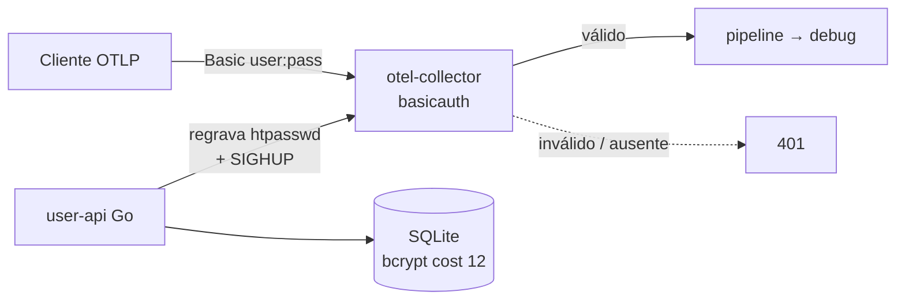

# 04 — Basic Auth (htpasswd)

Collector valida `Authorization: Basic <base64(user:pass)>` contra um arquivo `htpasswd` (bcrypt) via extensão [`basicauth`](https://github.com/open-telemetry/opentelemetry-collector-contrib/tree/main/extension/basicauthextension). Uma **API Go** faz CRUD de usuários, regrava o `htpasswd` e sinaliza o collector. Cada credencial tem identidade legível (o `user`).



## Rodar

```bash
docker compose up --build -d

# cria usuário (senha aparece uma vez)
curl -sX POST localhost:8081/users -H 'X-Admin-Key: change-me-admin-key' \
  -H 'Content-Type: application/json' -d '{"name":"app-a","ttl_hours":720}'
# -> { "name":"app-a", "password":"..." }

# envia telemetria
curl -i localhost:4318/v1/traces -u "app-a:$PASSWORD" \
  -H 'Content-Type: application/json' -d '{"resourceSpans":[]}'

docker compose down -v
```

Sem creds → `401`. Senha errada → `401`. Creds válidas → `200`.

## Trade-offs

- **Zero dependência exótica**: qualquer cliente HTTP fala Basic Auth; ótimo p/ legado.
- **bcrypt é caro** (~50-100ms/verify, cost 12) — a `basicauth` faz cache por par user/pass aprovado, então só a 1ª request paga. Conexões long-lived dos SDKs OTel se beneficiam; clientes que reabrem conexão a cada request sofrem.
- Credencial reutilizável trafega em todo request (sob TLS) — TTL curto + rotação frequente.
- Reload via SIGHUP (restart); collector roda como UID `65532` p/ ler o `htpasswd` `0600` do volume compartilhado.
