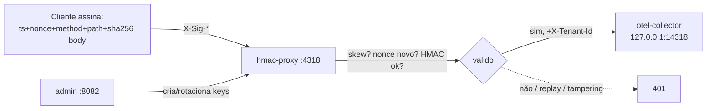

# 05 — Reverse proxy HMAC (anti-replay)

O collector **não fica exposto** — escuta só em loopback. Na frente, um reverse-proxy Go valida cada request OTLP/HTTP assinada com **HMAC-SHA256** (timestamp + nonce contra replay, hash do body contra tampering) e encaminha ao collector injetando `X-Tenant-Id`. O secret **nunca trafega**.



Headers por request: `X-Sig-KeyId`, `X-Sig-Timestamp` (epoch, ±300s), `X-Sig-Nonce` (único), `X-Sig` = `base64(HMAC_SHA256(secret, "{ts}\n{nonce}\n{method}\n{path}\n{sha256(body)}"))`.

## Rodar

```bash
docker compose up --build -d

# cria key
curl -sX POST localhost:8082/admin/keys -H 'X-Admin-Key: change-me-admin-key' \
  -H 'Content-Type: application/json' -d '{"tenant_id":"tenant-a"}'
# -> { "key_id":"...", "secret":"<base64>" }

# envia assinado (helper Python)
KEY_ID=... SECRET=... python3 - <<'PY'
import os,time,hmac,hashlib,base64,secrets,json,urllib.request
kid=os.environ["KEY_ID"]; sec=base64.b64decode(os.environ["SECRET"])
body=json.dumps({"resourceSpans":[]}).encode()
ts=str(int(time.time())); nonce=secrets.token_hex(16)
bh=hashlib.sha256(body).hexdigest()
msg=f"{ts}\n{nonce}\nPOST\n/v1/traces\n{bh}".encode()
sig=base64.b64encode(hmac.new(sec,msg,hashlib.sha256).digest()).decode()
req=urllib.request.Request("http://localhost:4318/v1/traces",data=body,method="POST",
  headers={"Content-Type":"application/json","X-Sig-KeyId":kid,"X-Sig-Timestamp":ts,
           "X-Sig-Nonce":nonce,"X-Sig":sig})
print(urllib.request.urlopen(req).status)
PY

docker compose down -v
```

Sem assinatura → `401`. Replay (mesmo nonce) → `401`. Tampering no body → `401`. Assinado corretamente → `200`.

## Trade-offs

- **Secret nunca trafega** + anti-replay (nonce/timestamp) + integridade do body. HMAC ~1µs/req.
- Cliente precisa implementar a assinatura — **não há SDK OTel pronto**; para clientes não controlados, prefira as abordagens 1/2/4.
- Só **OTLP/HTTP**. Para gRPC, use mTLS (03) ou bearer (01).
- Nonce store é em memória local — multi-réplica exige Redis (TTL = janela do skew).
