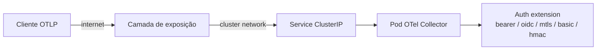

# Expondo o OTel Collector publicamente em Kubernetes

Discussão das opções de exposição do collector público (`v0.154.0`) na internet, comparando segurança, performance, custo e operação. Cada abordagem assume que **a autenticação na camada do collector já está resolvida** (ver as 5 pastas deste repositório); o foco aqui é como o tráfego chega até o pod.

---

## Topologia geral



A "camada de exposição" é onde mora a decisão. Abaixo, 5 possibilidades.

---

## Opção A — MetalLB (bare metal / on-prem)

MetalLB anuncia um IP virtual via BGP ou L2 (ARP/NDP), transformando um `Service type=LoadBalancer` em algo equivalente ao que cloud providers oferecem. Indicado quando o cluster está em datacenter próprio, homelab, edge.

### Pontos positivos

- Suporta **gRPC nativamente** via L4 (modo BGP recomendado para HA real).
- Latência mínima — o tráfego não passa por proxy aplicacional.
- Funciona com mTLS sem terminar TLS no meio do caminho (cliente fala TLS direto com o pod).
- Custo zero de licenciamento.

### Pontos negativos

- Você precisa de IP público roteável e BGP no roteador de borda (modo L2 funciona em /29 mas não escala).
- Sem proteção DDoS embutida — você fica exposto direto à internet. Recomendado colocar firewall L4 (`iptables`/`nftables`/eBPF) e rate-limit no NodePort/serviço.
- Sem WAF, sem geo-blocking — tudo isso é responsabilidade sua.
- Operação de BGP exige conhecimento de rede.

### Recomendado para

mTLS (pasta `03-mtls`) e HMAC Proxy (`05-hmac-proxy`), onde o overhead de um proxy L7 é indesejado e você quer terminar TLS no próprio collector.

```yaml
apiVersion: v1
kind: Service
metadata:
  name: otel-collector-public
  annotations:
    metallb.universe.tf/address-pool: public-pool
spec:
  type: LoadBalancer
  loadBalancerIP: 203.0.113.10
  externalTrafficPolicy: Local   # preserva client IP — importante para auditoria
  ports:
    - { name: otlp-grpc, port: 4317, targetPort: 4317, protocol: TCP }
    - { name: otlp-http, port: 4318, targetPort: 4318, protocol: TCP }
  selector:
    app: otel-collector
```

`externalTrafficPolicy: Local` é importante para preservar o IP do cliente (necessário para logs de auditoria e ratelimiting por IP). O custo é que pods sem endpoint local ficam de fora do balanceamento — combine com `topologySpreadConstraints` para distribuir réplicas.

---

## Opção B — Cloudflare Tunnel (`cloudflared`)

Túnel de saída do cluster para a borda da Cloudflare. **Não há IP público no cluster** — o `cloudflared` abre conexão de saída e a Cloudflare entrega o tráfego inbound via essa conexão.

### Pontos positivos

- **Sem IP público exposto** — superfície de ataque praticamente zero na rede.
- DDoS protection, WAF, rate limiting, bot detection já incluídos.
- TLS terminado na Cloudflare com certificado gerenciado.
- Cloudflare Access pode adicionar uma camada de auth (mTLS, SSO, JWT) **antes** do tráfego chegar ao collector — defense in depth com a auth do collector.
- Geo-blocking, IP allowlist, e regras WAF via dashboard.

### Pontos negativos

- **gRPC tem caveats**: Cloudflare suporta gRPC mas exige plano pago para gRPC unary; streaming é limitado. OTLP/gRPC unary funciona, mas teste antes de assumir.
- Latência adicional (cliente → POP Cloudflare → tunnel → cluster). Pequena, mas mensurável.
- Você passa a depender da Cloudflare — outage da Cloudflare = collector inacessível.
- mTLS "puro" (cliente → collector) não funciona; o TLS é terminado na Cloudflare. Para preservar a identidade do cliente, use Cloudflare Access com mTLS, que injeta um header `Cf-Access-Jwt-Assertion` validável.
- Custo: tunnel é grátis, mas features avançadas (WAF avançado, gRPC, Access) exigem planos pagos.

### Recomendado para

Bearer Token (`01-bearer-token`), OIDC (`02-oidc-jwt`), Basic Auth (`04-basic-auth`) — abordagens HTTP onde a perda de mTLS direto não é problema. Combinação ideal para **collectores expostos globalmente** sem infraestrutura de rede própria.

```yaml
# cloudflared como Deployment lateral, não há Service tipo LoadBalancer
apiVersion: apps/v1
kind: Deployment
metadata: { name: cloudflared }
spec:
  replicas: 2
  template:
    spec:
      containers:
        - name: cloudflared
          image: cloudflare/cloudflared:2025.4.0
          args: ["tunnel", "--no-autoupdate", "run", "--token", "$(TUNNEL_TOKEN)"]
          env:
            - name: TUNNEL_TOKEN
              valueFrom: { secretKeyRef: { name: cloudflared-token, key: token } }
```

E no dashboard da Cloudflare, mapeia `otlp.example.com` → `http://otel-collector.observability.svc.cluster.local:4318`.

---

## Opção C — Ingress NGINX + cert-manager (Let's Encrypt)

O caminho clássico. Ingress NGINX expõe via `Service type=LoadBalancer` (cloud) ou NodePort + MetalLB (on-prem), e termina TLS com certs do Let's Encrypt via cert-manager.

### Pontos positivos

- Observabilidade nativa (métricas Prometheus do NGINX).
- Suporte a HTTP/2 e gRPC com `nginx.ingress.kubernetes.io/backend-protocol: GRPC`.
- Headers customizados, rate-limit, IP allowlist via annotations — útil como camada extra antes da auth do collector.
- Padronização: provavelmente já existe no cluster.

### Pontos negativos

- Termina TLS no NGINX — perde-se mTLS direto. Existe `auth-tls-secret` annotation que permite mTLS terminado no NGINX, com header `ssl-client-verify` propagado.
- Mais um hop = mais latência e mais um lugar para falhar.
- Configuração de gRPC + mTLS no NGINX é não-trivial e tem pegadinhas (HTTP/2 path, cipher suites).

### Recomendado para

Cenários onde você já tem ingress controller padronizado e quer reaproveitar. Combina bem com Bearer/OIDC/Basic. Para mTLS, prefira MetalLB.

---

## Opção D — Cloud Load Balancer (NLB / GCLB / Azure LB)

Em EKS/GKE/AKS, o `Service type=LoadBalancer` cria um L4 LB nativo. Para OTLP, use NLB (AWS) ou TCP/UDP LB equivalente — **não use ALB/HTTP LB**, porque eles re-empacotam HTTP/2 e quebram gRPC streaming.

### Pontos positivos

- Operação gerenciada pelo cloud provider.
- Health checks, multi-AZ, autoscaling integrado.
- Integração com WAF do cloud (AWS WAF, Cloud Armor, Azure Front Door) para filtragem L7 antes do collector.
- Suporta mTLS direto (L4 passthrough).

### Pontos negativos

- Custo: cada NLB tem custo fixo + custo por LCU/byte. Para um único collector exposto, é caro vs. Cloudflare Tunnel.
- Sem DDoS protection L7 sem WAF adicional.
- IP público exposto — você precisa de Security Groups/Network Policies bem desenhadas.

### Recomendado para

Qualquer abordagem, mas especialmente mTLS em ambientes cloud onde MetalLB não se aplica.

```yaml
apiVersion: v1
kind: Service
metadata:
  name: otel-collector-public
  annotations:
    service.beta.kubernetes.io/aws-load-balancer-type: nlb
    service.beta.kubernetes.io/aws-load-balancer-scheme: internet-facing
    service.beta.kubernetes.io/aws-load-balancer-cross-zone-load-balancing-enabled: "true"
spec:
  type: LoadBalancer
  externalTrafficPolicy: Local
  ports:
    - { name: otlp-grpc, port: 4317, targetPort: 4317 }
    - { name: otlp-http, port: 4318, targetPort: 4318 }
  selector: { app: otel-collector }
```

---

## Opção E — Gateway API + Istio/Envoy

Service mesh moderno via Gateway API. Envoy faz TLS termination, autorização (JWT, OAuth2), rate-limit global e mTLS interno entre serviços.

### Pontos positivos

- Política unificada (`AuthorizationPolicy`, `RequestAuthentication`) — pode validar JWT do cliente **antes** de bater no collector. Funciona como pré-filtro para a auth do collector.
- Suporte excelente a gRPC.
- Telemetria rica do próprio mesh (que ironicamente vai para esse collector).

### Pontos negativos

- Complexidade operacional alta. Não vale a pena se você só precisa expor um único collector.
- Latência extra do sidecar/gateway.
- Curva de aprendizado.

### Recomendado para

Clusters que já rodam Istio/Linkerd. Combina especialmente bem com OIDC (`02-oidc-jwt`) — você pode validar o JWT no Envoy E no collector como defense in depth.

---

## Comparação resumida

| Opção             | mTLS direto | gRPC nativo | DDoS embutido | IP público exposto | Custo | Complexidade |
| ----------------- |:-----------:|:-----------:|:-------------:|:------------------:|:-----:|:------------:|
| MetalLB           | sim         | sim         | não           | sim                | baixo | média        |
| Cloudflare Tunnel | não*        | parcial     | sim           | **não**            | baixo | baixa        |
| Ingress NGINX     | sim**       | sim         | não           | sim                | baixo | média        |
| Cloud LB (NLB)    | sim         | sim         | parcial       | sim                | médio | baixa        |
| Istio Gateway     | sim         | sim         | não           | sim                | médio | alta         |

\* Cloudflare Access com mTLS injeta JWT validável, mas o handshake TLS termina na Cloudflare.
\** Via `auth-tls-secret`, com NGINX validando o cert do cliente.

---

## Recomendações práticas por cenário

- **Homelab / on-prem com mTLS**: MetalLB + `externalTrafficPolicy: Local` + auth mTLS no collector. Sem proxy no meio.
- **SaaS público recebendo telemetria de clientes na internet**: Cloudflare Tunnel + Bearer Token ou OIDC. WAF e DDoS resolvidos.
- **Cluster cloud com requisitos de mTLS para auditoria**: NLB + collector com `tls.client_ca_file`.
- **Múltiplos serviços no mesmo cluster, política centralizada**: Istio Gateway + `RequestAuthentication` validando JWT antes do collector revalidar.
- **Setup rápido para PoC**: Ingress NGINX + Basic Auth.

---

## Hardening adicional (qualquer opção)

1. **NetworkPolicy** restritiva: só o ingress controller / cloudflared pode falar com o pod do collector. Bloqueie tráfego cluster-interno desconhecido.
2. **PodDisruptionBudget** + HPA para o collector — DoS de aplicação não derruba todas as réplicas.
3. **Resource limits** rígidos no collector e no proxy de auth — evita OOM kill cascateado em pico de tráfego.
4. **Memory limiter processor** no pipeline do collector (`memory_limiter`) **antes** de qualquer outro processor — protege contra exhaustion mesmo com auth válida mandando volume absurdo.
5. **Rate-limit por tenant** (no proxy de auth ou na camada de exposição) — auth válida não é licença para flood.
6. **Audit log** dos eventos de auth: quem autenticou, quando, de qual IP. Essencial para investigar abuso.
7. **Rotação de credenciais** automatizada — bearer tokens, JWT signing keys, certificados todos com TTL curto e renovação programada.
8. **Egress firewall**: o collector não deveria precisar falar com a internet. Restrinja saída ao backend de telemetria (Tempo, Loki, Prometheus, etc.).
