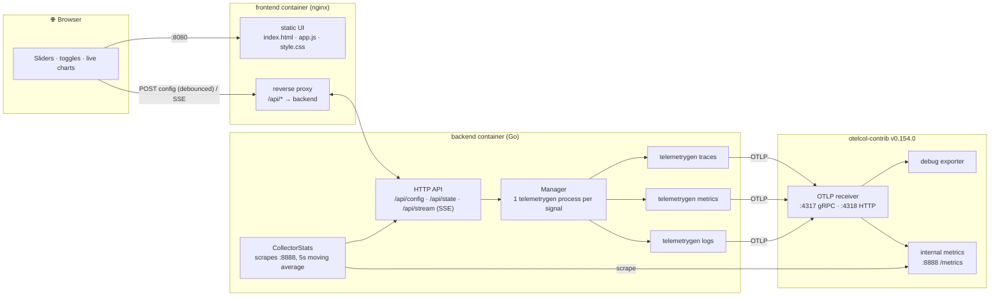
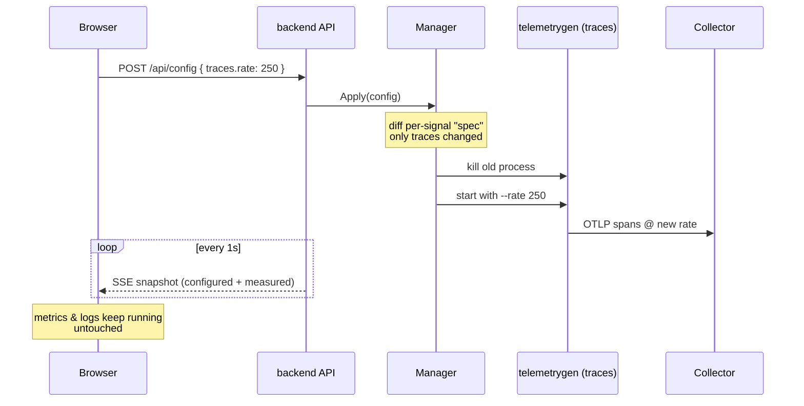
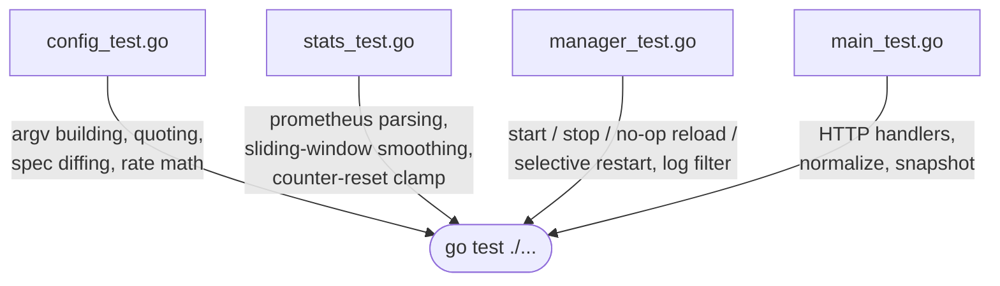

# Otelcol Load Ramping

A small **load-testing playground for the OpenTelemetry Collector** with a web
UI to drive **traces, logs and metrics** at a volume you can tune **live, while
the test is running** — like `k6`, but every knob is hot-reloadable from the
browser.

Under the hood it drives
[`telemetrygen`](https://github.com/open-telemetry/opentelemetry-collector-contrib/tree/main/cmd/telemetrygen)
(one process per signal) and reports the **real, server-side measured
throughput** by scraping the Collector's own internal metrics. Everything —
including the **OpenTelemetry Collector v0.154.0** — comes up with a single
`docker compose up`.


---

## What you get

- **Per-signal control panel** — independent rate / workers / attributes for
  traces, logs and metrics, each with its own enable toggle.
- **Runtime hot reload** — drag a slider and the *only* the affected signal's
  generator restarts (~instantly) with the new parameters. No restart of the
  whole test, no editing YAML.
- **Throughput you can trust** — two numbers side by side:
  - **Configured (target)** = `rate × workers`, computed instantly client-side.
  - **Collector received (measured)** = derived from the Collector's
    `otelcol_receiver_accepted_*` counters on `:8888`, smoothed over a 5 s
    sliding window so batch exports don't make it flicker.
- **Live sparklines** per signal + a tail of the real `telemetrygen` output.
- **Point anywhere** — defaults to the bundled Collector, but you can target any
  OTLP endpoint (gRPC or HTTP, insecure or TLS, custom headers). The metrics
  scrape endpoint (host:port) is editable in the UI too.
- **Live connectivity status** — three indicators under the title: browser↔backend,
  the OTLP **endpoint** (TCP-reachable?), and the **metrics endpoint** (scraping?).
- **Zero-dependency backend** — pure Go standard library; the UI is plain
  HTML/JS served by a separate nginx frontend.
- **Live-reload dev loop** — `docker compose watch` and a `Tiltfile` with
  frontend and backend as independent, hot-reloading services.

---

## Architecture

Frontend and backend are **separate services**: the browser talks only to the
**frontend** (nginx), which serves the static UI and reverse-proxies `/api/*` to
the **backend** (Go) — so the UI stays same-origin and SSE streams cleanly.



### Hot-reload sequence



Each signal has a **spec** (a fingerprint of its full `telemetrygen` argv).
`Apply` only restarts a signal whose spec actually changed, so tuning traces
never interrupts your logs or metrics stream.

---

## Quick start

Pick whichever workflow you like — all three bring up the same stack:

```bash
cd otelcol-load-ramping

docker compose up --build      # 1. plain run
docker compose watch           # 2. run + auto rebuild/sync on file changes
tilt up                        # 3. Tilt dashboard with per-service live reload
```

Then open **<http://localhost:8080>**.

| Service     | Port(s)             | Purpose                                  |
|-------------|---------------------|------------------------------------------|
| `frontend`  | `8080`              | Web UI (nginx) + reverse proxy to backend |
| `backend`   | *(internal :8080)*  | Go control API + telemetrygen processes  |
| `otelcol`   | `4317`, `4318`      | OTLP gRPC / HTTP receiver                |
| `otelcol`   | `8888`              | Collector internal Prometheus metrics    |

Toggle a signal on, drag the **rate** and **workers** sliders, and watch the
**Collector received** number track your target in real time.

> The bundled Collector uses the `debug` exporter (it just counts/prints what
> arrives). Swap it for a real backend in
> [`collector/config.yaml`](collector/config.yaml) to load-test a downstream
> system.

---

## Using it

### Controls

| Control            | Maps to telemetrygen flag        | Notes |
|--------------------|----------------------------------|-------|
| Endpoint (OTLP)    | `--otlp-endpoint`                | e.g. `otelcol:4317`, or any OTLP target |
| Metrics endpoint   | *(backend scrape target)*        | host:port or URL of the collector's `:8888` metrics; drives the measured throughput + status |
| insecure           | `--otlp-insecure`                | disable TLS |
| use HTTP           | `--otlp-http`                    | OTLP/HTTP instead of gRPC |
| Service name       | `--service`                      | `service.name` resource attr |
| **Rate**           | `--rate` (per worker)            | records/sec **per worker**; `0` = unthrottled |
| **Workers**        | `--workers`                      | goroutines; total ≈ `rate × workers` |
| Attributes         | `--telemetry-attributes`         | one `key=value` per line |
| Child spans        | `--child-spans` (traces)         | spans per trace (see note below) |
| Status code        | `--status-code` (traces)         | `Unset` / `Ok` / `Error` |
| Span duration      | `--span-duration` (traces)       | e.g. `1ms` |
| Metric type        | `--metric-type` (metrics)        | `Gauge` / `Sum` / `Histogram` / `ExponentialHistogram` |
| Log body           | `--body` (logs)                  | log message text |
| Min size (MB)      | `--size` (traces / logs)         | pad each record to a minimum size |

> **Throughput math.** telemetrygen's `--rate` is a per-worker rate limiter, so
> the records the Collector counts ≈ `rate × workers` for **every** signal.
> Notably, in this (duration-based) mode `--child-spans` changes how spans are
> grouped into traces but does **not** multiply the spans/sec — the limiter
> throttles per span. This is verified end-to-end and reflected in the
> "configured" estimate.

### Stopping

The **■ Stop all** button disables every signal (and kills the processes)
without losing your slider settings — flip a toggle back on to resume.

---

## API

The UI is just a client of a tiny HTTP API you can script against:

| Method | Path           | Description                                            |
|--------|----------------|--------------------------------------------------------|
| `GET`  | `/api/state`   | Current config + running flags + latest rates + logs   |
| `POST` | `/api/config`  | Replace the config and reconcile processes (hot reload)|
| `POST` | `/api/stop`    | Disable all signals                                     |
| `GET`  | `/api/stream`  | Server-Sent Events: a snapshot once per second          |

```bash
# Enable traces at 200 spans/s (100/worker × 2 workers)
curl -s localhost:8080/api/config -H 'Content-Type: application/json' -d '{
  "endpoint":"otelcol:4317","insecure":true,
  "traces":{"enabled":true,"rate":100,"workers":2,"childSpans":1,
            "attributes":{"env":"prod"}},
  "metrics":{"enabled":false},
  "logs":{"enabled":false}
}'
```

### Configuration (env vars on the `backend` container)

| Variable                | Default                          | Purpose |
|-------------------------|----------------------------------|---------|
| `LISTEN_ADDR`           | `:8080`                          | API listen address |
| `TELEMETRYGEN_BIN`      | `/usr/local/bin/telemetrygen`    | path to the generator binary |
| `COLLECTOR_METRICS_URL` | `http://otelcol:8888/metrics`    | where to scrape measured throughput |

---

## Development

Two live-reload workflows are wired up:

- **`docker compose watch`** — edits to `backend/**` rebuild the backend image;
  edits to the static UI sync straight into nginx; `collector/config.yaml`
  restarts the collector.
- **`tilt up`** — the same, in the Tilt dashboard, with the fastest backend loop:
  Go is compiled **on the host** and the binary is synced into the container
  (no image rebuild), while UI files sync instantly. Frontend and backend show
  up as independent resources.

The backend is a standalone Go module in [`backend/`](backend) with **no
external dependencies**.

```bash
cd backend

# Run the test suite (config building, prometheus parsing, rate windowing,
# process lifecycle with a fake generator, HTTP handlers)
go test ./...

# Run locally (needs telemetrygen on PATH and a collector to point at)
go install github.com/open-telemetry/opentelemetry-collector-contrib/cmd/telemetrygen@v0.154.0
COLLECTOR_METRICS_URL=http://localhost:8888/metrics go run .
```

### Layout

```
otelcol-load-ramping/
├── docker-compose.yaml        # collector + backend + frontend
├── Tiltfile                   # per-service live reload (frontend / backend)
├── collector/config.yaml      # OTLP in → debug; internal metrics on :8888
├── frontend/                  # static UI + nginx reverse proxy
│   ├── index.html / app.js / style.css
│   ├── nginx.conf             # serves UI, proxies /api/* (incl. SSE) to backend
│   └── Dockerfile
└── backend/                   # Go control API (no UI)
    ├── main.go                # HTTP API, SSE, snapshot assembly
    ├── config.go              # Config types → telemetrygen argv + rate math
    ├── manager.go             # per-signal process lifecycle + log filtering
    ├── stats.go               # collector /metrics scrape + sliding-window rates
    ├── *_test.go              # unit tests for all of the above
    ├── Dockerfile             # prod: builds backend + bakes telemetrygen
    └── Dockerfile.dev         # Tilt: telemetrygen + host-built binary
```

### What the tests cover



---

## Troubleshooting

- **`Bind for 0.0.0.0:4317 failed: port is already allocated`** — another
  Collector (e.g. from a sibling folder in this repo) is already publishing the
  OTLP ports. Stop it, or change the host-side ports in
  [`docker-compose.yaml`](docker-compose.yaml).
- **"Collector received" shows `—` / "unreachable"** — the backend couldn't
  scrape `COLLECTOR_METRICS_URL`. This is expected when you point the load at an
  *external* collector whose `:8888` isn't reachable from the `backend`
  container; the **Configured (target)** number still works.
- **Measured rate lags a target change for a few seconds** — the measured value
  is averaged over a 5 s window, so it ramps to the new level rather than
  snapping. The configured number updates instantly.
