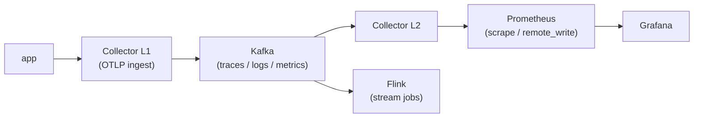

# Experiments with OpenTelemetry Collector, Prometheus, Kafka, and Flink

## Goal

Run heavy telemetry processing (aggregation, percentiles, anomaly detection, ML feature extraction) **out of band**, so it never impacts the main application flow.

The producing application does one thing only: push OTLP to a local L1 Collector over gRPC/HTTP. From there, everything is asynchronous:

- L1 writes to Kafka and returns immediately. Backpressure from Flink, Prometheus, or any downstream consumer is absorbed by Kafka, not by the app.
- Consumers (L2 Collector, Flink jobs) read from Kafka at their own pace. If Flink is slow or down, the app keeps running and telemetry keeps being produced.
- Enrichment, sampling, joins, sketching, ML feature pipelines all run on the Kafka side. The application path is never blocked waiting on analytics.

Kafka is the decoupling point. Everything to the left of Kafka is hot path; everything to the right is analytics and must not leak latency back.

## Architecture



- **Collector L1** — OTLP receiver on the app side. Writes to Kafka and returns. `network_mode: host`.
- **Kafka** — durable buffer and fan-out point between hot path and analytics. Topics: `otlp-traces`, `otlp-logs`, `otlp-metrics`.
- **Collector L2** — Kafka consumer. Handles fan-out to backends without touching the app path.
- **Flink** — stream processing over the same Kafka topics, independent of L2.
- **Prometheus** — scrapes collectors, Flink, Kafka exporter, cAdvisor. Remote-write receiver enabled.
- **Grafana** — dashboards auto-provisioned from `grafana/provisioning/`.

## Services


### Port Binding

| Service          | Port(s)                                          | Notes                              |
|------------------|--------------------------------------------------|------------------------------------|
| Grafana          | 3000                                             | UI                                 |
| Flink UI         | 8082                                             | job status, task slots             |
| Flink RPC        | 6123                                             | internal RPC                       |
| Prometheus       | 9090                                             | remote write receiver enabled      |
| Kafka UI         | 8083                                             | topic inspection, lag              |
| Kafka            | 9092                                             | external listener (host)           |
| Kafka Exporter   | 9308                                             | Prometheus metrics for Kafka       |
| Zookeeper        | 2181                                             | Kafka coordination                 |
| cAdvisor         | 8080                                             | per-container resource usage       |
| Collector L1     | 4317 (gRPC), 4318 (HTTP), 8888, 13133            | OTLP ingest; `network_mode: host`  |
| Collector L2     | 24133                                            | health check                       |

## Running

```bash
docker compose up -d
```

Teardown:

```bash
docker compose down -v
```

The `flink-job-submitter` container picks up all `*.jar` files from `./flink-jobs/` on startup and submits them to the Flink cluster.

## Dashboards

Grafana provisions the following dashboards from `grafana/provisioning/dashboards/json/` (Grafana → Dashboards, datasource `prometheus`):

| Dashboard | UID | Source | What it shows |
|-----------|-----|--------|---------------|
| Kafka Exporter Overview | `jwPKIsniz` | [grafana.com/dashboards/7589](https://grafana.com/grafana/dashboards/7589) | Broker count, topic partitions, messages-in/out rate, **consumer-group lag per topic/partition** |
| Apache Flink (2021) Dashboard for Job / Task Manager | `wKbnD5Gnk` | [grafana.com/dashboards/14911](https://grafana.com/grafana/dashboards/14911) | JM/TM JVM (CPU, heap, GC, threads), task slots, running jobs, checkpoints, backpressure, network buffers, records/bytes in/out |
| Collectors Overview | `collectors-overview` | custom | Per-collector (L1 / L2) rate + count split by signal (spans / logs / metric points). Pie chart of L1 receiver traffic split by transport (gRPC vs HTTP). |
| cadvisor dashboard | `cadvisor-main` | custom | Per-container CPU, memory, network, blkio, fs. |

Prometheus scrape targets (`config/prometheus.yml`):

| Job | Endpoint | Notes |
|-----|----------|-------|
| `cadvisor` | `cadvisor:8080` | per-container |
| `kafka` | `kafka-exporter:9308` | Kafka broker / topic / consumer-group metrics |
| `otel-collector-l1` | `host.docker.internal:8888` | L1 is `network_mode: host` |
| `otel-collector-l2` | `collector-l2:8888` | bridge network |
| `flink-jobmanager` | `flink-jobmanager:9249` | `PrometheusReporterFactory` |
| `flink-taskmanager` | `flink-taskmanager:9249` | `PrometheusReporterFactory` |

## Load test — `telemetrygen` with varied resource attributes

`tests/run-telemetrygen.py` spawns parallel `telemetrygen` containers that send OTLP spans, metrics, and logs to the stack. Each "variation" is a distinct topdomain (drawn from `tests/variations.json`) combined with the 9 resource attributes the Pagmon Java agent uses:

| Attribute | Source |
|-----------|--------|
| `topdomain` | picked from `variations.json` (`otype: topdomains`) — distinct per variation |
| `domain` | random domain under the chosen topdomain |
| `product` | subdomain key if present, else the domain key |
| `applicationslug` | `<leaf>-service` |
| `systemslug` | leaf key |
| `team` | rotated (`kanazawa`, `osaka`, `tokyo`, ...) |
| `context_business` | rotated (`cash_in`, `cash_out`, `onboarding`, ...) |
| `vertical` | rotated (`contapj`, `contapf`, `retail`, ...) |
| `segregated` | `true` / `false` |

Defaults: **20 topdomain variations × 3 signals = 60 parallel telemetrygen containers**, each emitting 5 records/sec for 10 minutes, 50% sent over OTLP/gRPC (port 4317) and 50% over OTLP/HTTP (port 4318).

```bash
# one-time
python3 -m venv tests/.venv

# run with defaults (20 variations × traces+metrics+logs, mixed grpc/http)
tests/.venv/bin/python tests/run-telemetrygen.py

# tuning
tests/.venv/bin/python tests/run-telemetrygen.py --variations 30 --duration 30m --rate 10
tests/.venv/bin/python tests/run-telemetrygen.py --signals traces,logs --duration inf
tests/.venv/bin/python tests/run-telemetrygen.py --http-ratio 0        # only gRPC
tests/.venv/bin/python tests/run-telemetrygen.py --http-ratio 1        # only HTTP
tests/.venv/bin/python tests/run-telemetrygen.py --endpoint localhost:4317 --seed 42
```

Stop all workers with `Ctrl+C` (the launcher `docker rm -f`s every container it spawned). Manual cleanup:

```bash
docker ps -q -f name=telemetrygen- | xargs -r docker rm -f
```

### Port 4317 conflict

`collector-l1` uses `network_mode: host` and binds `0.0.0.0:4317`. If another OTLP collector is already running on the host (e.g. a Pagmon app-side collector from `app/deploy/docker-compose.yml`), L1 will crash-loop with `listen tcp 0.0.0.0:4317: bind: address already in use`. Stop the other collector first:

```bash
docker stop deploy-otelcol-1   # or whatever it's named
docker compose up -d collector-l1
```

Otherwise telemetrygen will still succeed (it sends to whichever collector owns the port), but the data will not land in this stack's Kafka / L2 / Flink pipeline.

## References

- https://nightlies.apache.org/flink/flink-docs-stable/docs/connectors/datastream/prometheus/
- https://github.com/apache/flink-connector-prometheus
- https://opentelemetry.io/docs/collector/scaling/
- https://flink.apache.org/
- https://www.confluent.io/blog/apache-flink-stream-processing-use-cases-with-examples/
- https://github.com/google/cadvisor
