# Bubble-app architecture

End-to-end data path from telemetrygen workers to the D3 bubble chart in the
browser.

```mermaid
flowchart LR
  subgraph Load["telemetrygen workers"]
    L1[bubble-svc-01..20<br/>geometric rates]
    L2[fake-service<br/>--workers 4 --rate 1000]
  end

  subgraph Ingest["Collector L1 (host network)"]
    R1[":4317 gRPC<br/>otlp.transport=grpc"]
    R2[":4318 HTTP/proto<br/>otlp.transport=http/protobuf"]
    R3[":4319 HTTP/json<br/>otlp.transport=http/json"]
  end

  subgraph Kafka["Kafka"]
    KT[(otlp-traces)]
    KL[(otlp-logs)]
    KM[(otlp-metrics)]
  end

  subgraph Flink["Flink job<br/>otlp-insights-processor"]
    FJ["sum by service_name × signal<br/>→ Prometheus counters<br/>via PrometheusReporterFactory"]
  end

  PROM["Prometheus :9090<br/>scrapes flink-taskmanager:9249"]

  subgraph Backend["bubble-app backend (FastAPI :8089)"]
    POLL["poll loop · every 2s<br/>1 query: sum by (service_name, signal)"]
    REC["state.records<br/>{(svc,sig) → value}"]
    H1["GET /api/services?signal=…"]
    H2["GET /api/stream?signal=…<br/>(SSE)"]
    H3["GET /api/totals"]
  end

  subgraph Browser["Browser http://localhost:8089"]
    UI["index.html + style.css"]
    JS["app.js<br/>D3 force layout · CSS-style transform zoom"]
    TABS["all · traces · logs · metrics"]
    BUB(("bubble chart<br/>radius ∝ √count"))
  end

  L1 -->|gRPC| R1
  L2 -->|gRPC| R1
  L1 -.->|opcional HTTP| R2
  L1 -.->|opcional HTTP| R3

  R1 --> KT & KL & KM
  R2 --> KT & KL & KM
  R3 --> KT & KL & KM

  KT --> FJ
  KL --> FJ
  KM --> FJ

  FJ -->|PromQL counters<br/>flink_…_records_by_service_total| PROM

  PROM --> POLL
  POLL --> REC
  REC --> H1
  REC --> H2
  REC --> H3

  TABS -->|click → reconnect SSE| H2
  H2 -->|data: snapshot| JS
  H1 -.snapshot.-> JS
  H3 -->|tab counters every 3s| TABS
  UI --> JS
  JS --> BUB
```



## Component notes

### Load — `tests/run-bubble-load.py`
Spawns N telemetrygen containers in parallel. Service `i` is rated to send
`top_records · (1 − decay)^i` records over `--duration` seconds. Defaults: 20
services, top 100 000 records, 20 % decay, 600 s.

### Ingest — `config/collector-l1-config.yaml`
Three OTLP receivers tagged at the resource level so the Flink job can split
traffic by transport. All three feed the same Kafka topics, partitioned by
signal type.

### Flink job — `flink-jobs/otlp-insights-processor/`
Consumes the three Kafka topics, parses OTLP protobuf, and emits Prometheus
counters labelled `(service_name, signal, …)`. Exposed by the Flink
TaskManager's PrometheusReporter on `:9249`.

### Prometheus
Scrapes `flink-taskmanager:9249` every 15 s. Counter relevant to this app:
`flink_taskmanager_job_task_operator_signal_service_name_otlp_signal_records_by_service_total`.

### Backend — `app/backend/main.py`
FastAPI + httpx + asyncio. One query per poll cycle:
`sum by (service_name, signal) (counter)`. The result is cached in
`state.records`; per-tab slicing happens on demand via `compute_snapshot(signal)`.

| route | purpose |
|---|---|
| `GET /api/services?signal=…` | one-shot snapshot |
| `GET /api/stream?signal=…` | SSE stream, push on every poll tick |
| `GET /api/totals` | per-signal totals for tab counters |
| `GET /api/health` | liveness |

Each SSE subscriber registers `(queue, signal)`; the poll loop puts the
already-filtered snapshot on each subscriber's queue.

### Frontend — `app/frontend/`
Vanilla HTML + CSS + D3 v7. Single `<svg>` with a root `<g>` that holds the
bubbles.

- Force layout: `forceX`, `forceY`, `forceCollide` based on per-bubble radius.
- Viewport: manual `{zoom, panX, panY}` state, mirrors
  `timeline.nochaos.io`. Wheel zooms anchored to cursor (factor 1.08 / 0.92,
  range `[0.05, 8]`); pointer drag pans; `+` `−` `0` keyboard shortcuts; HUD
  buttons `−` `100 %` `＋` `RESET`. Labels are counter-scaled (`12 / zoom`)
  so they stay ~12 px on screen at any zoom level; tiny bubbles fall back to
  the trailing number.
- Tabs reconnect the SSE with `?signal=` and reset bubble nodes (the value
  scale changes per signal).
- `Cache-Control: no-store` middleware on the backend prevents the browser
  from sticking to old `app.js`.

## Why HTTP + SSE (not gRPC)

| factor | impact |
|---|---|
| browser is the client | gRPC-web would need an envoy/grpcwebproxy hop |
| stream is one-way server → client | SSE fits perfectly, no need for full duplex |
| upstream API is HTTP/JSON (Prometheus) | no protocol conversion |
| simpler ops | no protobuf compile step, no codegen |

## Run

```bash
docker compose up -d                                 # stack
tests/.venv/bin/python tests/run-bubble-load.py      # load
PROMETHEUS_URL=http://localhost:9090 \
  tests/.venv/bin/python -m uvicorn app.backend.main:app --port 8089
# open http://localhost:8089
```
