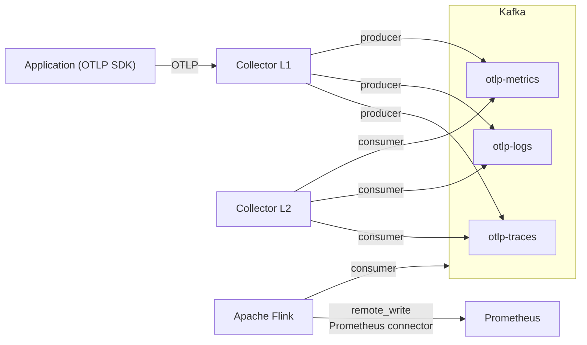

# Pagmon challenge

Your quest is to design and implement an architecture that generates intelligence from OTLP data received by PagMon’s OpenTelemetry pipeline. To achieve this, you will use Kafka as the decoupled streaming layer and Apache Flink for continuous, real-time processing and analysis. The objective is to go beyond the standard OTLP data flow by building a pipeline capable of extracting deeper insights into application behavior, ultimately enhancing observability and data intelligence.

## Quest 1

Understanding the data received today from **spans** and **metrics** in the Opentelemetry Collector. This involves extracting OTLP data from the gateways for more detailed analysis.

### Actions taken

- OTLP data was extracted from spans and metrics in both JSON and Proto formats.
- The PagBank tag tree was extracted.
- An "otelfeed" application was created that can retrieve these OTLP data files in JSON format and send them to the OpenTelemetry Collector component.
- A tree-based visualization application was created that shows the organizational structure of PagBank.
- The "metrics.md" document shows the metrics collected by the OpenTelemetry auto-instrumentation.
- Application configuration files were extracted to use Pagmon (opentelemetry).

### Application configuration files

Environment ECS

```sh
JAVA_OPTS = "-Xmx512m -XX:MaxMetaspaceSize=256m -XX:MaxDirectMemorySize=256m -Dfile.encoding=UTF-8 -Dlog4j2.formatMsgNoLookups=true -javaagent:/opt/opentelemetry/v2/opentelemetry-javaagent.jar -Dotel.service.name=funds-addition-service -Dotel.exporter.otlp.endpoint=http://collector.pagmon.qa.intranet.pags:4317 -Dotel.resource.attributes=topdomain=bank,domain=fundsaddition,applicationslug=funds-addition-service,systemslug=funds-addition,team=kanazawa,context_business=cash_in,vertical=contapj,product=adicao_fundos,segregated=true -Dotel.exporter.otlp.protocol=grpc"
```

Configmap

```yaml
kind: ConfigMap
apiVersion: v1
metadata:
  labels:
    app: account-card-authorizer-tecban
    Team: portland
    gr/application: e0c8f085-88fa-47ff-8faf-233c3f398425
  name: account-card-authorizer-tecban
  namespace: bank-cards-accountcard
data:
  JAVA_OPTS: "-XshowSettings -Dfile.encoding=UTF-8 -Dnetworkaddress.cache.ttl=60 -Dnetworkaddress.cache.negative.ttl=0"
  JAVA_TOOL_OPTIONS: "-javaagent:/opt/opentelemetry/v1.32/opentelemetry-javaagent.jar"
  OTEL_RESOURCE_ATTRIBUTES: "team:portland;environment:qa;dc:tb"
  OTEL_SERVICE_NAME: "account-card-authorizer-tecban"
  OTEL_TRACES_EXPORTER: "otlp"
  MANAGEMENT_OTLP_METRICS_EXPORT_URL: "http://collector.pagmon.qa.intranet.pags:4318/v1/metrics"
  SERVER_PORT: "8080"
  SPRING_CLOUD_CONFIG_LABEL: "qa"
  SPRING_PROFILES_ACTIVE: "qa,k8s,tb"
  SPRING_APPLICATION_NAME: "account-card-authorizer-tecban"
```

Spring Boot configuration file

```yaml
otlp:
  url: http://collector.pagmon.qa.aws.intranet.pags:4318/v1/metrics
  resourceAttributes: "service.name=transaction-replication-general-ledger-qa"
management:
  otlp:
    tracing:
      endpoint: http://collector.pagmon.qa.aws.intranet.pags:4318/v1/traces
    metrics:
      export:
        url: "http://collector.pagmon.qa.aws.intranet.pags:4318/v1/metrics"
        aggregationTemporality: "cumulative"
        resourceAttributes:
          service.name: transaction-replication-general-ledger-qa
```

### Run tree-viewer

```bash
cd phase-1/tree-viewer
python3 -m http.server 8000
http://localhost:8000/tree-viewer/
```

### Run otelfeed

```bash
cd phase-1/otelfeed
cd otelfeed
make tidy        
make build      
make collector  
make run-http         
make run-grpc
```

## Phase 2

Create a processing architecture using Apache Kafka and connecting to Apache Flink.

- Architecture created using mermaid
- Components configured to run on docker-compose
- Kafka and Otel Collector metrics and other configured components

### Architecture



### Images

- confluentinc/cp-zookeeper:7.5.0
- confluentinc/cp-kafka:7.5.0
- provectuslabs/kafka-ui:v0.7.2
- otel/opentelemetry-collector-contrib:0.147.0
- flink:1.20.1-scala_2.12-java11
- curlimages/curl:8.5.0
- ghcr.io/google/cadvisor@sha256:5534ae91cbf3428998d60428d107cfdd97272d80658534ac6e54d8ce3b0c4d72
- danielqsj/kafka-exporter:v1.9.0
- prom/prometheus:v2.47.0
- grafana/grafana:11.4.0

### Port Binding

| Service          | Port(s)                                          | Notes                              |
|------------------|--------------------------------------------------|------------------------------------|
| Grafana          | 3000                                             | UI                                 |
| Flink UI         | 8082                                             | job status, task slots             |
| Flink RPC        | 6123                                             | internal RPC                       |
| Prometheus       | 9090                                             | remote write receiver enabled      |
| Kafka UI         | 8083                                             | topic inspection, lag              |
| Kafka            | 9092                                             | external listener (host)           |
| Kafka Exporter   | 9308                                             | Prometheus metrics for Kafka       |
| Zookeeper        | 2181                                             | Kafka coordination                 |
| cAdvisor         | 8080                                             | per-container resource usage       |
| Collector L1     | 4317 (gRPC), 4318 (HTTP), 8888, 13133            | OTLP ingest; `network_mode: host`  |
| Collector L2     | 24133                                            | health check                       |

### Running

Up docker compose services

```bash
cd phase-2
docker compose up -d
```

Load test(telemetrygen)

```bash

python3 -m venv tests/.venv
tests/.venv/bin/python tests/run-telemetrygen.py

# tuning
tests/.venv/bin/python tests/run-telemetrygen.py --variations 30 --duration 30m --rate 10
tests/.venv/bin/python tests/run-telemetrygen.py --signals traces,logs --duration inf
tests/.venv/bin/python tests/run-telemetrygen.py --http-ratio 0        # only gRPC
tests/.venv/bin/python tests/run-telemetrygen.py --http-ratio 1        # only HTTP
```

```
telemetrygen traces  --traces  100000 --workers 2 --rate 1000 --service fake-service --otlp-insecure --otlp-endpoint localhost:4317 &
telemetrygen metrics --metrics 100000 --workers 2 --rate 1000 --service fake-service --otlp-insecure --otlp-endpoint localhost:4317 &
telemetrygen logs    --logs    100000 --workers 2 --rate 1000 --service fake-service --otlp-insecure --otlp-endpoint localhost:4317 &
wait

```bash
docker compose down -v
```

 ./bin/otelfeed --dir ../samples/otlp-json --http http://localhost:4318 --rate 50

## Phase 3

Creating jobs for Apache Flink based on basic ideas.

- Spans vs Metrics vs Logs
- Volume by service (service.name)
  - Spans per second
  - Metric datapoints per second
  - Log records per second
- Transport protocol: gRPC vs HTTP/protobuf vs HTTP/JSON
- Ecosystem / runtime:
  - telemetry.sdk.language (java, go, python, node, dotnet...)
  - telemetry.sdk.name and telemetry.sdk.version
- Deployment environment:
  - cloud.provider (aws, gcp, azure)
  - k8s.cluster.name, k8s.namespace.name
  - deployment.environment (prod, staging, dev)
- Spans with errors (status.code = ERROR) and with exception events

```promql
otlp_signal_records_total{signal}
otlp_signal_records_by_service_total{signal, service_name}
otlp_signal_records_by_transport_total{signal, transport}
otlp_signal_records_by_sdk_language_total{signal, sdk_language}
otlp_signal_records_by_sdk_total{signal, sdk_name, sdk_version}
otlp_signal_records_by_cloud_total{signal, cloud_provider}
otlp_signal_records_by_k8s_total{signal, k8s_cluster_name, k8s_namespace_name}
otlp_signal_records_by_environment_total{signal, deployment_environment}
otlp_spans_errors_total{service_name}
otlp_spans_with_exceptions_total{service_name, exception_type}
```

## Phase 4

Flink processes OTLP data to format it in Parquet and sends it to object storage.

## Phase 5

Create a job for Apache Flink that can generate graphs of span flows, which can be displayed to understand the health of each flow.


## References

```text
https://flink.apache.org/2024/12/05/introducing-the-new-prometheus-connector/
https://nightlies.apache.org/flink/flink-docs-stable/docs/connectors/datastream/prometheus/
https://github.com/apache/flink-connector-prometheus
https://opentelemetry.io/docs/collector/scaling/
https://flink.apache.org/
https://www.confluent.io/blog/apache-flink-stream-processing-use-cases-with-examples/
https://github.com/google/cadvisor
```
